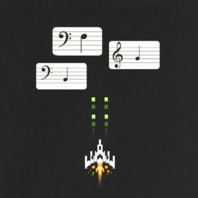
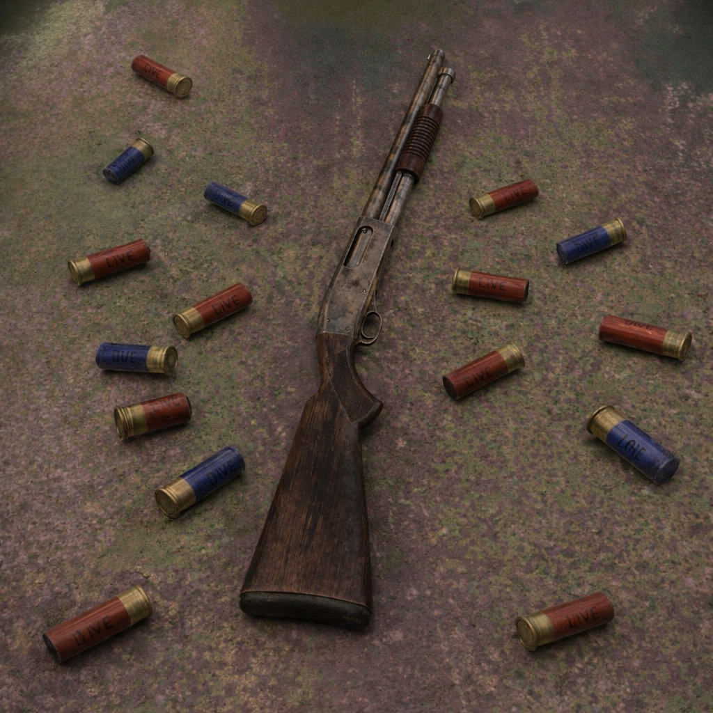

# Piano Drills

  

Piano Drills is a web app made to help people learn piano in a fun and interactive way. It turns practice into small arcade-style games so players can work on note reading, ear training, and rhythm.

## Games

### Note Invaders

  

Practice sight reading by identifying incoming notes before they reach your ship. This mode is designed to help players get faster at recognizing notes on the staff and connecting them to the keyboard. [inspired by zty.pe]

### Play It By Ear

  

Train your ear by listening, reacting, and matching what you hear. This game focuses on note recognition through sound so players can build stronger pitch awareness and musical memory. [inspired by Buckshot Roullet]

### Tempo Run

  

Work on rhythm and timing in a side-scrolling runner game where jumps are tied to musical pulse. This mode helps players develop steadier timing and better rhythmic control in a more playful format.
